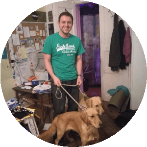

# Dzmitry Mishkovich



## CONTACTS
*Brest, Belarus*

***Email:*** *dzmitrymishkovich@gmail.com*

***GitHub:*** *DZMTRK*

***Discord:*** *dzmtrk#6915*

***LinkedIn:*** [to My profile page](https://www.linkedin.com/in/dzmitry-mishkovich-902697237)

## SUMMARY
Since childhood, I have been interested in everything related to computers and computer technologies. It's kind of my hobby and part of my job. I spent a lot of time working as a computer network administrator and network engineer. Now I want to change my career to web application development.
My main goal is to get enough knowledge and practice to apply for a job in the FE Junior position. I would like to be part of a team and create something useful for people.

## SKILLS
Web-development: HTML5, CSS3, JavaScript
Frameworks: Bootstrap
Version control: GIT, Github
Graphics: Figma, GIMP, InDesign

## CODE
```
function solution(number){
  let z = [];
  if (number < 0) {return 0;};
  for (let i = 1; i < number; i++) {
    if ((i % 3 === 0)||(i % 5 === 0)) {
      z.push(i);
    };
  };  
    return z.reduce((a,b) => a + b, 0);
};
```

## COURCES
+ Codecademy HTML Course
+ Codecademy CSS Course
+ Codecademy JavaScript Course

## PROJECTS
+ [Portfolio site](https://dzmtrk.github.io/portfolio/)
+ [Find-your-hat game](https://github.com/DZMTRK/find-your-hat-starting)
+ [Mystery-organism](https://github.com/DZMTRK/mystery-organism-starter)

## EDUCATION
Brest State University

## ENGLISH
B1 - Pre-Intermediate